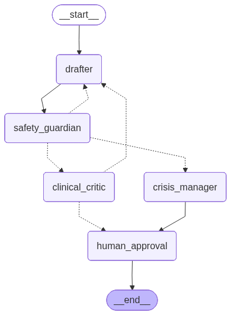
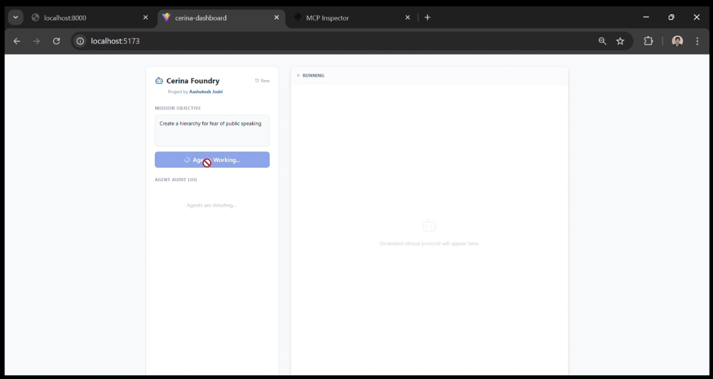

# Cerina Foundry 🏥

**An Agentic Workflow for Clinical Protocol Generation**


## 📖 Overview

**Cerina Foundry** is a specialized multi-agent AI system designed to assist mental health professionals in drafting **Cognitive Behavioral Therapy (CBT)** clinical protocols. Unlike standard LLM interactions, Cerina employs a "Foundry" of specialized agents that collaborate, critique, and refine clinical content before it ever reaches a human for final approval.

The system prioritizes **safety** and **clinical accuracy** through a rigorous Human-in-the-Loop architecture, ensuring that no AI-generated medical advice is finalized without oversight.

## 🎥 Demo & Walkthrough

[]([YOUR_VIDEO_LINK_HERE](https://drive.google.com/file/d/1JVs_IvuoTh7UXbgM4IEMntNBppH-Fzy4/view?usp=sharing))

*(Click the image above to watch the full system demonstration)*

---

## 🤖 The Agent Roster

The workflow is orchestrated using **LangGraph**, consisting of four distinct agents:

1.  **✍️ The Drafter (Creative Agent)**
    * **Role:** Generates the initial clinical protocol and rewrites drafts based on feedback.
    * **Behavior:** Uses a temperature of 0.7 for creativity. It is context-aware; if a draft is rejected, it analyzes the specific critique history to fix the errors in the next iteration.

2.  **🛡️ Safety Guardian (Compliance Agent)**
    * **Role:** The first line of defense. It analyzes content for self-harm, violence, or illegal advice.
    * **Mechanism:** Uses **Structured Output** validation. If high-risk content (e.g., suicide ideation) is detected, it bypasses standard loops and immediately triggers the *Crisis Manager*.

3.  **🩺 Clinical Critic (QA Agent)**
    * **Role:** Acts as a clinical supervisor. It scores drafts on "Empathy" and "CBT Structure" (1-10 scale).
    * **Mechanism:** If the score is below threshold, it rejects the draft and sends it back to the *Drafter* with actionable feedback.

4.  **🚨 Crisis Manager (Intervention Agent)**
    * **Role:** Activates *only* during severe safety events.
    * **Action:** It overwrites the generated text with a safe, supportive resource message (e.g., helpline numbers) and sends a real-time **Discord Webhook** alert to the engineering/medical team.

---

## 🔮 Deep State Management (The "Brain")

To satisfy the requirement for a "rich, structured state", the agents share a strictly typed schema, acting as a shared project workspace.

```python
class CerinaState(TypedDict):
    """
    The Blackboard State shared across all agents.
    """
    # Conversation history (Standard LangChain messages)
    messages: Annotated[list[BaseMessage], add_messages]
    
    # The live artifact being iterated on
    current_draft: str
    
    # Circuit breaker to prevent infinite critique loops
    iteration_count: int
    
    # Append-only log of all agent critiques (The "Memory")
    critique_history: Annotated[List[Critique], lambda x, y: x + y]
    
    # Workflow status
    final_status: Literal["drafting", "reviewing", "approved", "rejected"]
```

Why this matters: By storing critique_history as a persistent list, the Drafter agent has full context of why previous attempts failed, enabling true agentic learning within the session.

---
## 🧠 System Architecture & State Logic

This project demonstrates advanced state management and fault tolerance.

### 1. Human-in-the-Loop
The workflow is designed to explicitly pause at the `human_approval` node using LangGraph's **`interrupt`** mechanism.
* Agents refine the draft until it passes automated checks.
* The system pauses execution and waits.
* The Human (via the React UI or MCP) reviews the draft.
* **Feedback Loop:** If rejected, the human's feedback is injected into the state, and the *Drafter* attempts a rewrite.

### 2. SQLite Persistence (Fault Tolerance)
We utilize `SqliteSaver` as a checkpointer to persist the graph state after every node execution.
* **Why is this critical?** In standard web apps, refreshing the page often kills the active process.
* **In Cerina Foundry:** If a user generates a draft and refreshes the browser, the session is **not lost**. The frontend re-fetches the state using the `thread_id` from the SQLite database, resuming the workflow exactly where it left off.

### 3. Model Context Protocol (MCP)
The system exposes an MCP Server (`mcp_server.py`), allowing external AI clients (like Claude Desktop) to:
* Trigger protocol generation remotely.
* Receive "Approval Required" interrupts.
* Submit reviews directly from the external client environment.

---

## 🛠️ Tech Stack

* **Orchestration:** LangGraph, LangChain
* **LLM:** OpenAI GPT-4o
* **Backend:** FastAPI, Python 3.11
* **Frontend:** React, Vite, TailwindCSS, Lucide Icons
* **Persistence:** SQLite
* **Integration:** Discord Webhooks (Alerts), Model Context Protocol (MCP)

---

## 🚀 Installation & Setup

### 1. Environment Setup
The project requires Python 3.11.

```bash
# Create and activate environment
conda create -n cerina python=3.11
conda activate cerina
```
---

## 2. Backend (Server)

Navigate to the root directory where `server.py` is located.

### Bash

```bash
# Install dependencies
pip install -r requirements.txt

# Create .env file with your keys
# OPENAI_API_KEY=sk-...
# DISCORD_WEBHOOK_URL=https://discord.com/api/webhooks/...

# Run the FastAPI Server
python server.py
```

Server runs at: **http://0.0.0.0:8000**

---

## 3. Frontend (Dashboard)

Navigate to the `cerina_foundry\cerina-dashboard` folder.

### Bash

```bash
npm install
npm run dev
```

UI runs at: **http://localhost:5173**

---

## 4. Running via MCP Inspector

To test the Model Context Protocol integration:

### Bash

```bash
npx @modelcontextprotocol/inspector python mcp_server.py
```

---

# 🔮 Future Roadmap: RAG Integration

To further enhance safety, the next iteration of **Cerina Foundry** will implement Retrieval-Augmented Generation (RAG).

### Objective
Reduce hallucinations and improve risk detection.

### Implementation
Before the Safety Guardian assesses a prompt, the system will query a vector database containing a curated set of:

- High-risk medical queries  
- Adversarial prompts  

### Benefit
This ensures contextually similar dangerous queries are flagged **immediately**, based on medical guidelines—not solely on LLM probabilistic inference.

---

# 📂 Repository Structure

```
graph.py       - Defines the StateGraph, routing logic, and checkpointers.
nodes.py       - Contains the agent definitions (Drafter, Safety, Clinical, Crisis).
state.py       - Defines the CerinaState and Critique TypedDicts.
server.py      - FastAPI backend for the React UI.
mcp_server.py  - MCP Server implementation for external clients.
main.py        - CLI entry point for testing the graph locally.
```
